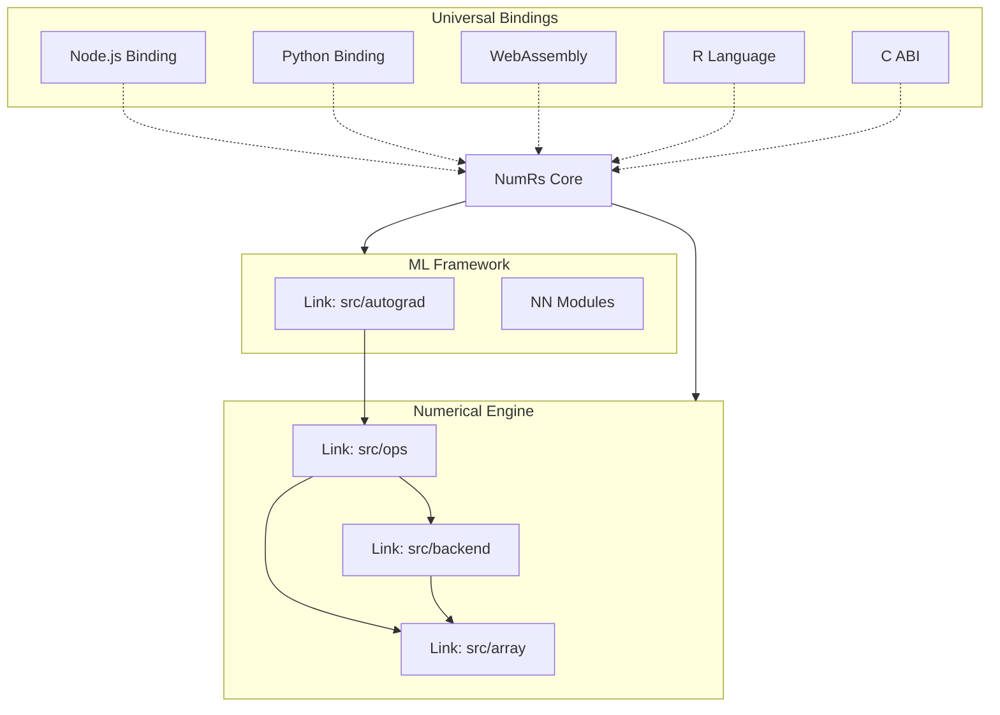

# NumRs

> **High-Performance Numerical & Deep Learning Engine for Rust, Python, Node.js, R, and WASM.**


[](https://numrs.dev)


> [!WARNING]
> **This project is currently in Alpha.** APIs are subject to change and it is not yet recommended for mission-critical production use.

**NumRs** (Numeric Rust) is a next-generation numerical computing ecosystem. Built from scratch in Rust, it provides a unified, high-performance engine that powers bindings across the most popular programming languages. It combines the ease of use of NumPy/PyTorch with the safety and speed of safe Rust.

Whether you are training models in Python, deploying to the browser with WebAssembly, or building backend services in Node.js, **NumRs guarantees the same behavior, same performance, and same API everywhere.**

---

## ⚡ Key Features

*   **Universal Core**: A single, robust Rust codebase powers all 5 bindings. Write logic once, run it anywhere.
*   **Hardware Acceleration**: Auto-detects and uses AVX2/AVX-512 (x86) or Accelerate/Metal (Apple Silicon) for near-native speeds.
*   **Deep Learning Native**: Built-in autograd engine (Reverse-mode AD) and a complete suite of Neural Network layers (`Linear`, `Conv1d`, `LSTM`, `Transformer`).
*   **Zero-Copy Architecture**: Bindings share memory directly with the Rust core, eliminating serialization overhead for large tensors.
*   **Production Ready**: Thread-safe parallel execution via Rayon, rigorous type checking, and guaranteed memory safety.

---

## ⚡ Performance

NumRs is engineered for speed. On an **Apple M3 Max**, NumRs achieves **2.42 Tops/s** (Tera-operations per second) in matrix multiplication (FP32), utilizing Metal acceleration and SIMD optimizations.

| Backend             | Operation | Size          | Speed           |
| :------------------ | :-------- | :------------ | :-------------- |
| **Accelerate/BLAS** | `matmul`  | 2048x2048     | **2.42 Tops/s** |
| **Metal (GPU)**     | `mul`     | 100K elements | ~450 Mops/s     |
| **SIMD (CPU)**      | `sum`     | 1M elements   | ~5 Gops/s       |

> *Benchmark run via `cargo run --bin numrs-bench --release`*
>
> 📄 **[View Full Benchmark Report](numrs-core/BENCHMARK_Apple_M3_Max_Apple_M3.md)**


---

## ❤️ Contributors

Thank you to everyone who has contributed to NumRs!

[](https://github.com/rjaguiluz/numrs/graphs/contributors)

## 💰 Sponsors

Support the development of NumRs!

[](https://github.com/sponsors/rjaguiluz)
[](https://buymeacoffee.com/raguiluzm)

---

## 🏗 Architecture

NumRs is designed as a layered ecosystem. The core engine handles the heavy lifting, while optimized bindings expose idiomatic APIs for each language.



---

## 🌐 The Rosetta Stone

**If it works here, it works everywhere.**

Perform the same operations consistently across any language.

### Matrix Multiplication with Autograd

#### 🦀 Rust (Core)
```rust
use numrs::tensor::Tensor;

let a = Tensor::randn(&[2, 3], true);
let b = Tensor::randn(&[3, 2], true);
let c = a.matmul(&b);

c.backward();
println!("{:?}", a.grad());
```

#### 🐍 Python
```python
import numrs

# Drop-in replacement for standard workflows
a = numrs.randn([2, 3], requires_grad=True)
b = numrs.randn([3, 2], requires_grad=True)
c = a @ b

c.backward()
print(a.grad)
```

#### 🟢 Node.js
```javascript
import { Tensor } from '@numrs/node';

const a = Tensor.randn([2, 3], true);
const b = Tensor.randn([3, 2], true);
const c = a.matmul(b);

c.backward();
console.log(a.grad());
```

---

## � ONNX Interoperability

NumRs models can be exported to standard ONNX format, allowing you to visualize them in [Netron](https://netron.app) or deploy them with other runtimes.

#### 🐍 Python Export
```python
import numrs
# ... model training ...
dummy_input = numrs.randn([1, 10])
numrs.save_onnx(model, dummy_input, "model.onnx")
```

#### 🟢 Node.js Export
```javascript
import { Tensor } from '@numrs/node';
// ... model training ...
const dummyInput = Tensor.randn([1, 10]);
model.saveOnnx(dummyInput, "model.onnx");
```

#### 🧠 Inference (Import)
NumRs can also load and run ONNX models (even users from PyTorch/TensorFlow).

**Python**
```python
from numrs.onnx import OnnxModel

model = OnnxModel("model.onnx")
output = model.infer(dummy_input)
```

**Node.js**
```javascript
import { OnnxModel } from '@numrs/node';

const model = OnnxModel.load("model.onnx");
const output = model.infer(dummyInput.data); // specific array
```

---

## �🚀 Getting Started

Select your platform to get started:

| Language          | Install Command             | Documentation                                 |
| :---------------- | :-------------------------- | :-------------------------------------------- |
| 🦀 **Rust**        | `cargo add numrs`           | [View Rust Docs](numrs-core/DOCS.md)          |
| 🐍 **Python**      | `pip install numrs`         | [View Python Docs](bindings/numrs-py/DOCS.md) |
| 🟢 **Node.js**     | `npm install @numrs/node`   | [View JS Docs](bindings/numrs-js/DOCS.md)     |
| 🕸️ **WebAssembly** | `npm install @numrs/wasm`   | [View Wasm Docs](bindings/numrs-wasm/DOCS.md) |
| 📐 **R**           | `install.packages("numrs")` | [View R Docs](bindings/numrs-r/DOCS.md)       |
| 🇨 **C / C++**     | *Link `libnumrs_c.so`*      | [View C ABI Docs](numrs-c/DOCS.md)            |

---

---

## 🧭 Why NumRs Exists

Numerical computing shouldn’t be fragmented.

Today, numerical logic is rewritten for every platform:
Python for research, JavaScript for the web, C++ for performance.
Each rewrite introduces inconsistency, bugs, and friction.

NumRs exists to remove that fragmentation.
A single Rust core defines the behavior of every operation,
while each language provides only syntax, not semantics.

Write once.
Run everywhere.
Trust the math.

---

## 📄 License

**NumRs is dual-licensed.**

*   **Open Source**: [AGPL-3.0](LICENSE) (default). Free for open source, research, and internal use.
*   **Commercial**: Contact us for a commercial license if you need to use NumRs in proprietary products without copyleft obligations.

Copyright (c) 2025 NumRs Contributors.
