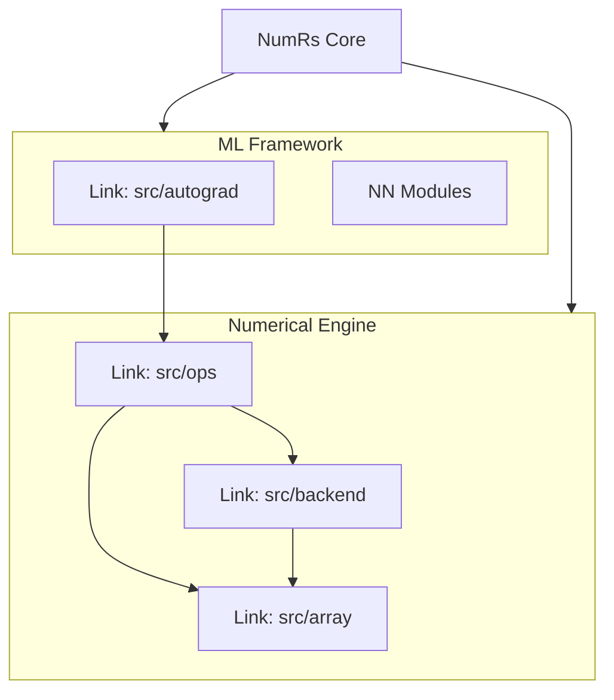

# numrs — core library

**NumRs** is an experimental, high-performance numerical & Deep Learning Engine framework for Rust, inspired by NumPy and PyTorch.

This project is structured as a collection of specialized modules, each with its own specific responsibility. This README serves as a high-level index to the detailed documentation for each component.

## Architecture Overview

NumRs is built on two main layers:
1.  **Numerical Engine**: Handles arrays, types, and raw execution (SIMD/BLAS).
2.  **Machine Learning Framework**: Built on top of the engine, providing autograd and neural networks.



## 📚 Ecosystem Documentation

Select your preferred language to view the specific documentation:

| Component      | Language          | Documentation                                 |
| :------------- | :---------------- | :-------------------------------------------- |
| **NumRs Core** | 🦀 **Rust**        | [View Rust Docs](numrs-core/DOCS.md)          |
| **NumRs C**    | 🇨 **C / C++**     | [View C ABI Docs](numrs-c/DOCS.md)            |
| **NumRs Node** | 🟢 **Node.js**     | [View JS Docs](bindings/numrs-js/DOCS.md)     |
| **NumRs Wasm** | 🕸️ **WebAssembly** | [View Wasm Docs](bindings/numrs-wasm/DOCS.md) |
| **NumRs Py**   | 🐍 **Python**      | [View Python Docs](bindings/numrs-py/DOCS.md) |
| **NumRs R**    | 📐 **R**           | [View R Docs](bindings/numrs-r/DOCS.md)       |

---

## DeepWiki Documentation (IA generated docs)

[DeepWiki](https://deepwiki.com/rjaguiluz/numrs)


## Quick Start

```bash
# Build with auto-detected optimizations (ASICS/BLAS)
cargo build --release
```

For detailed examples, see the `examples/` directory.

## License
AGPL-3.0-only
